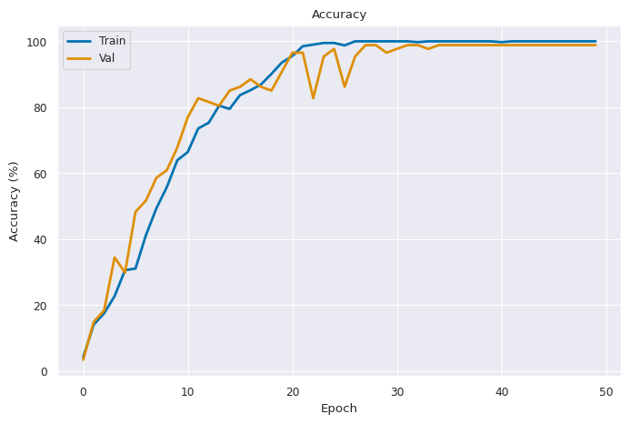

# BlinkerNet — 2FA Vehicle Authentication via Light Flash Sequence

A video classifier that identifies a vehicle by the blinker flash pattern it emits. Each pattern is a 14-bit binary code, encoded as left/right/both blinker activations across time. Trained on CARLA simulation data.

## Results

| Metric | Value |
|---|---|
| Train accuracy | 100% |
| Val accuracy (best) | 98.85% |
| **Test accuracy** | **94.25%** |
| Macro F1 | 0.94 |

29 classes × ~20 videos per class, 50 epochs, ~8 minutes on RTX 5060.



## Layout

```
.
├── README.md
├── requirements.txt
├── src/
│   ├── train_blinker_net.py     # Training entrypoint
│   ├── preprocess.py            # Extract grayscale frames from .avi videos
│   └── utils/
│       ├── blinker_net.py       # Model architecture
│       ├── video_dataset.py     # PyTorch Dataset for frame-folder layout
│       └── utils.py             # Logging helpers
├── data/
│   └── dataset_carla/           # Preprocessed JPEG frames (29 classes)
└── results/
    └── (training artefacts: model_best.pt, curves, log, confusion matrix)
```

## Setup

```bash
# Create environment (Python 3.10)
micromamba create -n blinker python=3.10 -y
micromamba activate blinker

pip install -r requirements.txt
```

## Reproduce training

The preprocessed JPEG frames are included under `data/dataset_carla/`, so you can train directly:

```bash
WANDB_MODE=offline python src/train_blinker_net.py
```

Output goes to `logs/blinkernet_<timestamp>/`.

To re-run preprocessing from raw `.avi` videos (not included in this repo — too large for GitHub):

```bash
python src/preprocess.py --input <path_to_raw_videos> --output data/dataset_carla
```

## Architecture rationale

The dataset has these properties:

- Short videos (~56 frames at 42 fps simulation rate)
- Sparse signal: only ~2 of 4 expected blinker pulses are caught per video
- Discriminative info = **temporal pattern + left/right** of the bright blinker patch
- Small training set (~14 samples per class after train/val/test split)

This rules out a naive 3D-CNN, which we verified empirically (0% test accuracy):

- 5 levels of `MaxPool3D(2,2,2)` compress 56 temporal frames to 1 — kills timing info
- 8×8 final spatial feature map loses fine-grained left/right localization
- 8–25M parameters overfit hard with so few samples

### BlinkerNet design

| Choice | Reason |
|---|---|
| 2-channel input: `[raw, abs(frame_t − frame_{t-1})]` | Frame differencing isolates blink edges; insensitive to absolute lighting |
| Per-frame 2D CNN encoder → 128-D feature | Preserves spatial layout so left/right blinker stays distinguishable |
| 1D temporal conv (no aggressive pooling) | Keeps the time axis intact so the sequence pattern survives |
| Soft-attention over time | Lets the model focus on the few frames where the blinker fires |
| 542K parameters | 16× smaller than the Conv3D baseline; matches the small dataset |
| Label smoothing + grad clip + cosine LR | Standard small-data regularization |

## Data format

- Raw videos: 1280×960 RGB `.avi`, ~56 frames each (a single full blink sequence)
- Folder name = 14-bit binary sequence; each pair `11`=both, `10`=right, `01`=left, `00`=none
- After preprocessing: grayscale 256×256 JPEG frames stored as
  `data/dataset_carla/class_NN_<sequence>/video_XXX/frame_YYYY.jpg`

## Known limitations

- Trained only on **ClearNight** weather in CARLA. Other weather conditions are not in the training set and the model will likely fail on them
- Blinker visibility depends heavily on vehicle distance from the camera. Some pulses are missed when the vehicle is far. The attention head learns to handle this, but extreme cases may still misclassify
- Only `vehicle.carlamotors.firetruck` blinkers behave correctly in CARLA — emergency vehicles like police and ambulance have built-in red/blue strobes that override the user-specified blinker sequence
